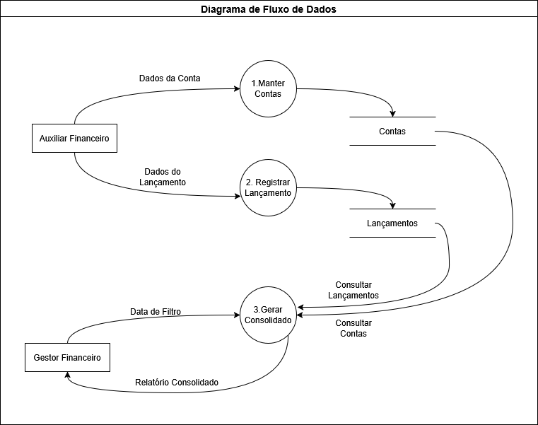

# **CashFlow Controle de Lançamentos Financeiros**

Esta é uma solução para lançamentos financeiros que permite o registro de entradas e saídas vinculadas às respectivas contas, facilitando o controle financeiro. A solução também oferece um serviço para geração de relatórios consolidados diários.

O diagrama de fluxo de dados a seguir apresenta as principais processos que a API realiza:

A solução foi estruturada em duas APIs: uma para o registro de lançamentos financeiros e outra para a geração do relatório consolidado diário, ambas compartilhando a mesma base de dados. Para garantir maior resiliência e escalabilidade, recomenda-se a implantação utilizando os serviços de Web Apps do Azure em conjunto com o Azure SQL Database.

Abaixo, segue uma representação gráfica da arquitetura proposta:

A implementação das APIs foi realizada em .NET 8, seguindo os princípios de *Clean Architecture* e outras boas práticas de desenvolvimento. Embora a solução esteja dividida em duas APIs, ambas compartilham os componentes de negócios. Atualmente, a arquitetura segue o modelo monolítico, mas com uma separação clara dos contextos, facilitando uma futura migração para micro serviços, caso necessário.

Além disso, foram escritos testes unitários para cada um dos principais tipos de classes criadas no projeto, com o objetivo de exemplificar como testar cada tipo de componente.

**"### 🛠 Instruções para rodar a solução**

1. **Crie uma base de dados no SQL Server.**

   **Atualize a \*string de conexão\* nos arquivos `appsettings.json` de ambas as APIs:**

   - Localize a chave `"ConnectionStrings"` e insira os dados da nova base.

   **Execute as APIs utilizando o Visual Studio:**

   - **`CashFlow.WebAPI`**: Responsável por registrar os lançamentos contábeis.
   - **`CashFlow.ReportWebAPI`**: Responsável por gerar o relatório consolidado.

   **Autenticação:**

   - Acesse o endpoint **`Auth/Login`** para autenticação inicial.
   - Credenciais:
     - **Email:** `usuario@teste.com`
     - **Senha:** `senhaTeste`

   **Migrations:**

   - Na primeira execução, as *migrations* serão aplicadas automaticamente, atualizando o banco de dados.
   - Uma massa de dados de teste será inserida para facilitar a validação inicial.